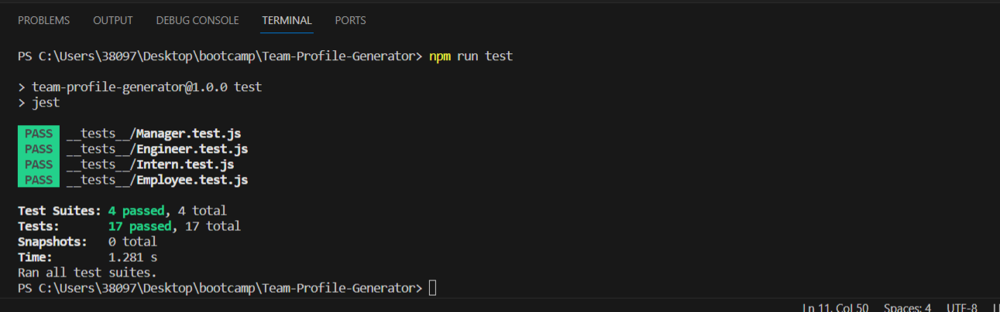
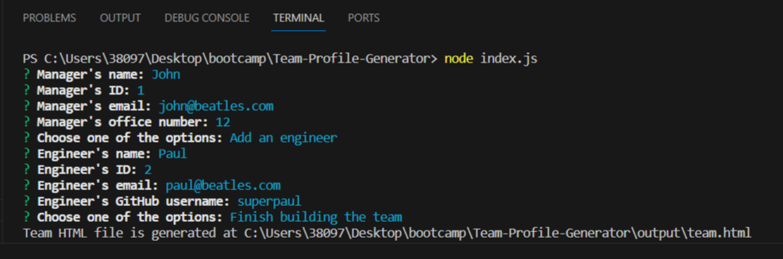
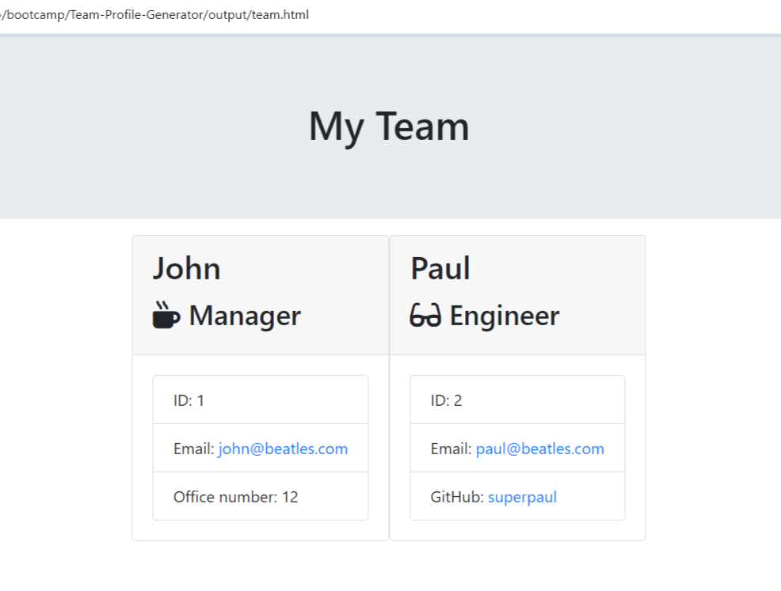

# Team-Profile-Generator

## Description

This application will take in information about employees on a software engineering team, then generate an HTML webpage that displays summaries for each person.

Deployed application: https://iabramidze.github.io/Team-Profile-Generator/
Video demonstration: https://youtu.be/UN0YFzpP2dI

## References

https://www.geeksforgeeks.org/node-js-fs-writefilesync-method/
https://www.geeksforgeeks.org/node-js-fs-mkdirsync-method/
https://www.geeksforgeeks.org/node-js-fs-existssync-method/